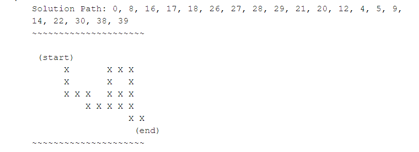

# Lab3

Write a program that reads in a graphical maze from a text file, and determines a solution path.  

Input:  
- a graphical representation of a maze from a text file  

Output:  
- the solution path as both a string of cell numbers and graphical representation to stdout  


## Get started  
```Bash  
cd src  
javac HW3_1.java   
java HW3_1  
sample_maze.txt  
    // can also choose from sample_maze1.txt ~ sample_maze4.txt
```
## Example

- input:  sample_maze.txt 


- output:   

## More Info
For more running results, please check out [report](report/report.pdf).

